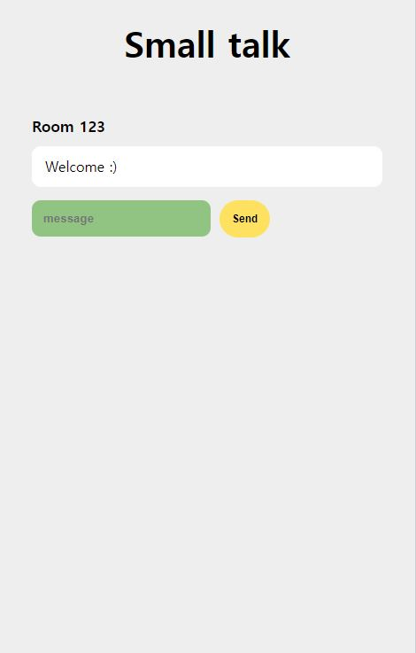

# Chatting_socketIO

Chatting_socketIO using NodeJS, WebRTC and Websockets.

### Preview

### Pages

- [x] Room name Page
- [x] Chat Page

### Skills

* WebSocket

### Features

* Socket instance의 속성을 사용해서 Event 만들어줌.
* Emit 이벤트로 서버와 클라이언트 사이에 이벤트 송신.
